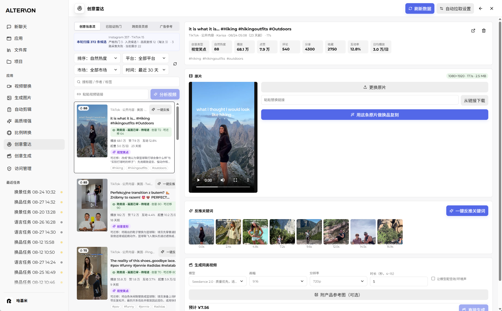
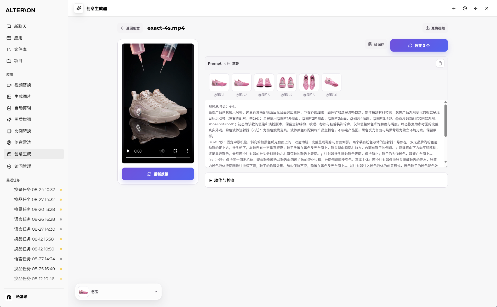
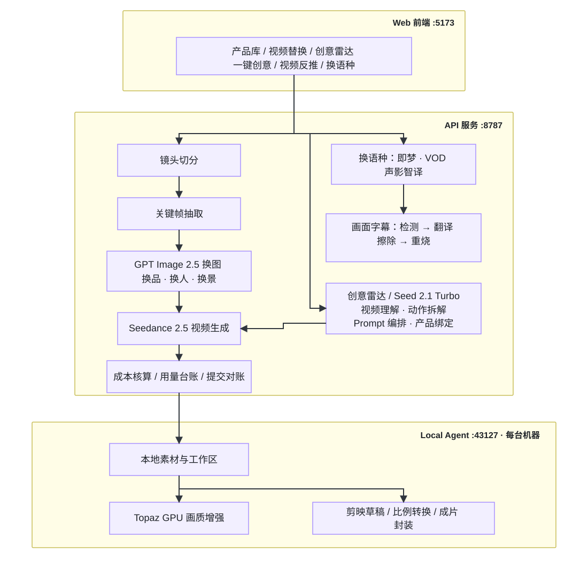

<p>
  
</p>

**ALTERION：面向鞋类电商的视频素材处理与创意生成系统。**

系统以参考视频和产品图片为输入，提供商品替换、人物与场景调整、多语种处理、创意生成和本地画质增强。网页工作台管理方案与任务，Studio API 调用模型服务并记录状态，Local Agent 负责设备端素材和媒体处理。

ALTERION is a video production tool for footwear e-commerce. It combines product replacement, scene adaptation, localization and creative generation in a shared web workspace, with local media processing on each editor's device.

   


<p align="center"></p>

本仓库展示项目设计、操作界面和部分实验记录。生成质量受参考素材、产品视角覆盖和模型能力影响；产品细节、复杂动作与多镜头一致性仍需审核。文中的样片与实验数据用于说明具体实现，不代表所有素材的生成效果。

---

## 目录

- [项目目标](#项目目标)
- [功能范围](#功能范围)
- [界面展示](#界面展示)
- [系统架构](#系统架构)
- [部署与运行](#部署与运行)
- [工程实践](#工程实践)
- [换景实验记录](#换景实验记录)
- [成本估算](#成本估算)
- [工程约束](#工程约束)
- [公开范围](#公开范围)
- [开发方式](#开发方式)
- [当前范围与后续计划](#当前范围与后续计划)
- [技术栈与许可](#技术栈与许可)

---

## 项目目标

项目服务于已有视频素材的复用和产品创意制作。商品替换需要尽量保留参考片的动作与镜头；创意改编则以剧情、人物与空间关系、表现手法为主要约束，允许合理的节奏和画面差异。

主要处理以下一致性问题：

| 问题 | 处理方向 |
|---|---|
| 产品视角覆盖不足 | 管理多视角参考图，为鞋底等关键展示面提供独立图片 |
| 原商品外观残留 | 明确目标商品的图片绑定，检查旧配色、结构和标识是否进入新方案 |
| 左右脚或不同配色混用 | 分开记录产品槽位、鞋型与穿戴关系，无法判断时保留未确认状态 |
| 原场景保留 | 为各镜头指定目标关键帧，并检查生成结果是否按要求更换背景 |
| 画面主体增减 | 区分外观调整与主体存在性，约束人物部位和商品数量 |
| 生成失败后的重复提交 | 保存任务与受理状态，支持用量对账及按片段重试 |

---

## 功能范围


| 功能 | 用途 | 主要实现 |
|---|---|---|
| **商品替换** | 将参考片中的商品替换为目标款式 | 镜头切分、关键帧换图、Seedance 编辑生成与片段合成；左右脚独立绑定 |
| **人物与场景调整** | 调整人物肤色、纹身和拍摄场地 | 人物与场景预设、目标关键帧生成、逐镜图片绑定 |
| **语种替换** | 翻译配音并处理口型与字幕 | 按源语种与所需功能选择即梦视频翻译或 VOD 声影智译，提供逐句校对与术语配置 |
| **画面字幕** | 处理已嵌入画面的字幕 | OCR 检测、翻译、擦除服务接口和字幕重新烧录 |
| **比例转换** | 输出不同画幅的视频 | 按目标比例计算裁切或补边区域 |
| **画质增强** | 在本机处理生成视频 | Topaz Gaia HQ、4× 放大与本地 GPU 编码 |
| **剪映草稿** | 继续编辑生成结果 | 导出包含素材与时间线的草稿工程 |
| **创意雷达** | 查找同类目内容和跨类目参考 | 内容采集、公开指标快照、画面筛选、原片预览与分析 |
| **一键创意** | 根据产品图生成短视频方案 | 生成创意方向、确认与编辑方案、动作编排、Prompt 生成 |
| **视频反推与裂变** | 将参考片的创意改编为目标产品方案 | 独立理解原片、制定改编方案、拆解动作、绑定产品图与审核 Prompt |

---

## 界面展示

### 主页


主页提供对话入口，并关联项目、文件库和功能工作台。用户可以描述新任务或继续处理已有项目。

### 视频替换工作台

#### 换品


系统切分镜头并抽取关键帧，结合多视角产品图生成目标关键帧，再用 Seedance 编辑模式生成视频片段并合成。参考图绑定分别记录左右脚、鞋底与关键展示面，用于约束多镜头中的产品外观。

#### 换景


用户选择人物外观与场地预设，系统生成目标关键帧并为各镜头指定参考图。外观调整规则只作用于原画面中已出现的部位，避免将纹身等要求误写成新增人体部位。

### 图片生成


提示词、参考图和生成参数记录为节点。用户可从指定结果继续修改，保留已有版本，用于产品图片、品牌视觉和标题素材的迭代。

### 比例转换


支持裁切与模糊补边，按所选画幅计算输出区域，并保留视频时长与音轨。可用于 9:16、1:1、16:9 等常见规格的素材适配。

### 文件库与使用手册


文件库集中提供操作说明、版本记录和业务文档，便于用户查询各功能的使用方法。

### 语种替换


配音翻译、口型处理与画面字幕分别处理。字幕流程包含检测、翻译、擦除和重新烧录，并提供导入、逐句修订及术语配置；具体语种和处理能力取决于所选服务。

### 画质增强


Local Agent 调用本机 Topaz，使用 Gaia HQ 放大视频，默认通过 H.264 NVENC 编码输出。网页显示任务状态和结果；处理效果需结合源素材检查，放大分辨率不等于恢复原始细节。

### 创意雷达



按类目、关键词、市场与时间窗口采集 TikTok / Instagram 内容，支持手动刷新和由用户开启定时采集。公开播放与互动指标、快照变化和画面审核用于组织候选列表；用户可预览、下载和分析参考片，并继续进入反推或商品替换流程。

### 创意生成



无参考片时，Seed 2.1 Turbo 根据产品图生成创意方向；用户确认或修改方案后，系统编排动作并生成 Prompt。上传参考片时，先独立分析原片的剧情、表现手法与关键关系，再结合产品图制定一套改编方案，依次完成动作拆解、结构校对和独立审核。

两条路径共用产品图片身份与左右型约束，通过 `@图片` 编号绑定参与生成的产品图。改编时可同步调整与产品关联的色彩、道具和效果；确认后的方案可提交 Seedance 2.5，结果可继续进行 Topaz 增强。

---

## 系统架构

<p align="center"></p>

| 组件 | 职责 |
|---|---|
| Web 工作台 | 产品与素材选择、方案编辑、任务提交、状态与结果展示 |
| Studio API | 工作流编排、模型服务调用、任务持久化、权限与用量管理 |
| Local Agent | 当前设备的素材访问、媒体处理、本地 GPU 增强与结果交付 |

模型服务在云端执行理解、图像或视频生成；需要上传的素材由对应任务流程准备。Local Agent 承担设备端媒体处理，使各工作站能够使用自己的文件系统和 GPU。

创意流程分别保存原片观察、改编方案、图片绑定、Prompt 和生成状态，便于恢复任务与复核生成依据。

---

## 部署与运行

系统通过公司局域网提供共享网页入口，各编辑设备安装 Local Agent。运行管理包括：

- **素材与设备绑定**：本机素材由对应 Local Agent 访问。云端理解或生成按需上传必要文件，临时文件按配置的保留策略清理。
- **Agent 分发与维护**：提供更新清单、开机自启和进程看护；网页连接当前设备的 Agent 处理本地媒体。
- **账号与访问控制**：账号注册需审批，按账号校验任务访问范围，并对本地素材操作校验设备和工作区绑定。
- **提交与用量对账**：保存生成任务的提交阶段、服务受理信息和用量记录；结合本地台账与服务端任务状态识别已受理、未受理及待确认的请求。进程内并发锁用于限制重复提交。
- **费用估算**：支持提交前估算和提交后记账，模型单价与汇率可配置。
- **任务恢复与数据保留**：服务重启后检查未完成任务，区分继续跟踪与用户主动结束的状态，并按策略清理运行数据。
- **错误上报**：错误信息按指纹聚合，便于定位重复问题。

---

## 工程实践

以下记录实现中的约束与取舍。实验结果仅适用于对应素材、模型版本和配置，功能状态以 2026-09-16 的发布核验为准。

### 1. 生成费用估算与用量记录

提交前根据模型、输入形式、时长和输出规格估算费用；提交后记录服务返回的用量，再按配置单价计算。参考视频的时长也会影响视频编辑任务的成本，因此不能只比较模型单价。

分段生成可以缩小失败重试的范围，但需要额外处理片段衔接、声音和产品连续性。是否分段由任务类型、时长限制及镜头结构决定，不作为普遍的降本策略。计算口径见[成本估算](#成本估算)。

### 2. 多视角产品参考图

产品图按外侧、内侧、正面、后跟、俯视和鞋底等视角管理，生成时通过图片编号绑定。图片数量受所选模型的能力配置约束；额度允许时优先使用独立参考图，避免拼版后单个视角过小。

鞋底特写单独提供完整参考图。左右型、配色与单件商品身份分别记录，避免把同款的不同视角误判为不同产品，也避免把左鞋和右鞋作为可互换资料。无法可靠判断的属性保留未确认状态。

### 3. 换景时的镜头与图像绑定

换景实验中，部分强调原片逐帧一致的提示词同时保留了原背景；仅声明全片使用新场地，也不能保证所有镜头都完成替换。

当前策略分别描述需要保留的动作、切点和需要替换的外观，并为每个镜头指定对应目标关键帧。该策略来自样本对比，模型内部的具体原因未经验证。

### 4. 显式指定视频编辑任务

换品、换景请求显式设置 `omni_reference_task_type: "edit"`，并在提交前检查参数与素材。目的是明确所需任务类型，减少服务对提示词意图的误判。

请求被拒绝、已受理但失败、已完成分别记录。是否产生费用依据返回用量及对账结果，不能仅根据页面上的失败状态判断。

### 5. 人物外观修改范围

肤色、纹身等改造仅作用于当前画面中已出现的人体部位。例如，只有手部的产品特写不应因人物预设而新增腿部。模板将外观属性与部位是否出现分开描述，并在检查时对照原画面。

这是一项生成约束，仍需在成片中检查是否出现多余肢体或前后不一致。

### 6. 画质增强模型选择

在早期鞋类生成素材的对照测试中，原有 Nyx 降噪组合损失了部分鞋面纹理和文字边缘；据此将默认增强预设改为 Topaz Gaia HQ 单次放大，并取消前置降噪组合。

选型主要依据同一素材的局部对照和完整播放。高频能量只能反映边缘与纹理变化，不能单独证明细节真实；不同来源的素材仍可能需要不同处理。

### 7. 放大倍率与编码兼容性

默认目标倍率为 4×，实际输出尺寸还受本机编码器能力限制。运行时探测并缓存编码器可接受的尺寸，超限时等比例约束输出，不把某张显卡、驱动和编码器组合的上限当作通用规格。

当前默认编码为 `h264_nvenc`，主要考虑工作台和剪辑端的播放兼容性。历史测试曾使用 HEVC 支持更大的画幅；编码尺寸、文件体积与终端解码支持需要同时考虑。提高输出尺寸不等于恢复更多真实细节。

### 8. 语音翻译服务与字幕处理

系统接入即梦视频翻译与 VOD 声影智译，根据源语种和服务支持范围选择处理路径。必要时可以分步经英语中转，但当前并非自动串联两项服务的流程。

画面内字幕独立经过检测、翻译、擦除和重烧，擦除服务已接入本地 ProPainter 和云端 MediaKit，使用取决于运行环境、配置及权限。翻译与字幕草稿可供校对；未配置擦除服务时提供未擦除预览，并明确记录该状态。

### 9. 创意解析与独立审核

有参考视频时，先只输入原片，记录故事、表现手法和关键关系，再结合目标产品确定一套改编方案。动作分析分别描述前态、过程、接触关系和后态，避免用“摔倒”“出现反应”等叙事摘要代替可执行动作。

独立审核直接对照原片、目标产品图和候选 Prompt，不使用前序分析结论作为通过依据。自动修订必须更新完整动作结构；无法通过的方案保留草稿与原因。

无参考视频时，从产品图与可选方向生成候选，筛选后由用户确认，再进行动作编排。两条流程共享产品身份与图片绑定约束，但无原片流程不使用原片分析阶段。审核通过表示文字方案满足检查项，不代表成片细节或传播效果已经验证。

---

## 换景实验记录

历史实验使用一条 21.85 秒、12 个镜头的母片，对比不同提示词和参考图绑定方式。前 8 轮使用完整母片，第 9 轮改用 7.4 秒、7 个镜头的截取片段，因此下表是迭代记录，不是同条件下的成功率比较，也不将所有轮次称为单变量实验。

| 轮次 | 主要调整 | 切点观察 | 场地观察及遗留问题 |
|---|---|---|---|
| 1 | 换品提示词增加人物、场地改造说明 | 短镜头缺失 | 部分镜头保留原背景 |
| 2 | 增加严格切镜指令 | 切点基本符合 | 全片仍保留原背景 |
| 3 | 将切点时间与关键帧时间分开 | 12 镜头的时序符合 | 前 4 镜保留原背景 |
| 4 | 明确排除原场地元素 | 12 镜头的时序符合 | 12 镜场地替换完成；两个约 0.8 秒短镜头的内容被邻镜动作延续覆盖 |
| 5 | 增加首帧身份与逐时刻同步要求 | 12 镜头的时序符合 | 前 8 镜保留原背景 |
| 6 | 仅保留首帧身份要求 | 出现额外切镜 | 前 7 镜保留原背景 |
| 7 | 简化为换品流程的简报式描述 | 12 镜头的时序符合 | 8/12 镜完成场地替换 |
| 8 | 全片统一指定一张场景参考图 | 切点基本符合 | 仅镜头 1 完成场地替换 |
| 9 | 为每镜显式指定对应目标关键帧；改用截取片段 | 片段内切点符合 | 7/7 镜完成场地替换 |


依据这些观察，流程采用逐镜显式图像绑定。第 9 轮只验证了截取片段，不能据此推算原片全长或其他素材的通过率；背景替换完成也不等于动作、商品细节和短镜头内容全部合格。

---

## 成本估算

费用区分提交前估算与提交后用量核算。单价、汇率可配置，页面统计用于任务成本管理；供应商账单是结算依据。

| 环节 | 记录方式 | 影响因素 |
|---|---|---|
| 图像编辑 | 按返回的文本输入、图像输入与图像输出用量计算 | 模型、图片规格、输出质量、重试次数 |
| 视频生成 | 按模型返回的用量与对应计价配置计算 | 输入是否含视频、参考时长、输出时长与画幅 |
| 视频理解与 Prompt | 记录输入、输出及可获得的缓存用量 | 视频采样、上下文长度、审核与修订轮次 |
| 本地增强与封装 | 不产生该处理步骤的模型 API 调用费用 | 本机耗时、设备占用、存储及软件许可成本 |

2026-08-11 的视频编辑成本记录采用以下估算口径：

```text
估算 tokens ≈ (参考视频秒数 + 输出视频秒数) × 输出宽 × 输出高 × 帧率 ÷ 1024
估算费用 = 估算 tokens ÷ 1,000,000 × 对应输入类型的配置单价
```

例如，参考与输出均为 22 秒、输出 480 × 854、24 fps，按当时含视频输入的配置价 ¥42 / 百万 tokens 估算，视频生成约 ¥17.75。该数值不含换图、理解、额外重试与本地处理成本，也不适用于直接按相同单价计算纯图片加 Prompt 的任务。

---

## 工程约束

2026-09-16 发布核验通过架构检查、JavaScript 语法检查、TypeScript 检查、1,114 项自动测试及生产构建。测试数量对应该次发布快照，不是实时 CI 状态或视频质量指标。

| 检查项 | 约束 |
|---|---|
| 模块边界 | 浏览器与 Node 模块分离；Local Agent 的本地依赖保持在独立包内；生产代码不引入测试代码；相对导入不能越出仓库 |
| 依赖解析 | 无法解析的本地相对导入导致检查失败 |
| 类型检查 | `tsc --noEmit --noUnusedLocals --noUnusedParameters` |
| 文件规模 | 800 行预警、1,000 行建议复核；不因行数单独阻断构建 |
| 媒体运行时 | 固定版本与校验，避免不同设备使用未经验证的运行时 |
| Prompt 与结构 | 对关键模板和结构约束进行回归检查；生成结果另行审核 |

部署时分别核对前端发布包、API 运行版本和 Local Agent 版本，避免本地测试代码与实际工作台使用不同版本。

---

## 公开范围

本仓库用于展示 ALTERION 的功能、架构和部分验证结果，包含 README 与经筛选的演示素材。生产源码、环境配置、密钥、运行数据和完整开发历史在独立的开发仓库中维护，本仓库不提供部署包。

---

## 开发方式

项目由 Renzihao 主导，需求来自公司剪辑团队。工作范围包括需求分析、架构设计、实验设计、结果验收和部署维护；Claude Code、Codex 等编程代理参与代码实现、测试、媒体分析与交叉复核。

---

## 当前范围与后续计划

| 状态 | 范围 |
|---|---|
| 已接入工作台 | 视频换品与换景、图片生成、语音翻译、字幕检测与翻译重烧、比例转换、Topaz 增强、剪映草稿、任务及成本管理 |
| 创意模块 | 素材发现、视频上传与反推、产品图驱动创意、确认后动作编排、多视角绑定、方案编辑与历史、Seedance 提交及状态展示 |
| 受服务配置限制 | 平台采集的数据可用性、各翻译服务支持的语种与权限、画面字幕擦除 |
| 持续验证 | 复杂动作与空间关系、左右鞋一致性、文字与标识准确性、长片多镜头换景、原创创意质量及自动审核准确性 |
| 后续探索 | 使用弱化原外观的运动参考，评估能否降低背景残留；引入投放反馈辅助创意排序；评估多视角重建对产品一致性的帮助 |

最近一次创意反推回归使用固定的两条参考视频与两款产品：首稿通过 1/2，另一条自动修订一次后最终通过 2/2，人工未修改 Prompt。两条均完成生成和增强，但成片仍记录了片尾标识偏差与单只鞋左右型风险。该结果用于确认本次流程接入，不代表不同视频类型的总体成功率。

---

## 技术栈与许可

`React 19` · `Vite` · `Express 5` · `Node.js ESM` · `SQLite` · `FFmpeg` · `Topaz Video AI` · `GPT Image 2.5` · `Seed 2.1 Turbo` · `Seedance 2.5` · `火山 TOS / VOD` · `即梦视频翻译`

本仓库为项目展示用途，保留所有权利；示例画面中的商品与素材归其相应权利人所有。
