# ALTERION

**视频模板自动替换 · 一条母片，换鞋、换人、换场地、换语种。**

> Given an existing product video and photos of a new product, ALTERION re-generates the same video with the new product in it — no reshoot. On top of that, the same master clip can be re-cast (skin tone, tattoos), re-located (indoor/outdoor courts) and translated into another language. Built for shoe e-commerce, running in production on a company LAN for multiple editors.

   

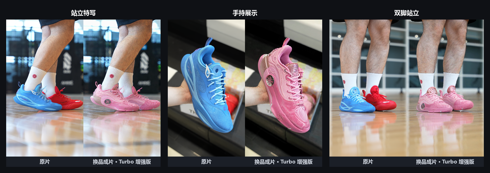

<p align="center">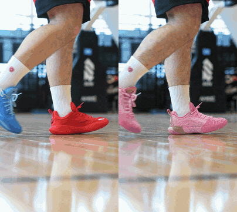</p>

| 生产任务（一周） | 付费生成提交 | 局域网使用账号 | 一条 22 秒换景片的生成成本 |
|:--:|:--:|:--:|:--:|
| **92** | **109** | **10** | **¥17.6** |

一条 15 秒的鞋类带货视频，重拍一次的成本是模特、场地、摄影、剪辑。这套系统把它压缩到**十几块钱和二十分钟**。

---

## 目录

- [做这件事难在哪](#做这件事难在哪)
- [能力面](#能力面)
- [界面展示](#界面展示)
- [系统架构](#系统架构)
- [企业部署](#企业部署)
- [关键工程决策](#关键工程决策)
- [案例：换景的八次单变量实验](#案例换景的八次单变量实验)
- [成本模型](#成本模型)
- [工程约束](#工程约束)
- [公开范围](#公开范围)
- [开发方式](#开发方式)
- [现状与规划](#现状与规划)

---

## 做这件事难在哪

"把视频里的鞋换掉"听起来是个替换任务，实际上难点全在**一致性**：

| 难点 | 表现 |
|---|---|
| **视角对不上** | 目标帧里鞋子转到某个角度，而你只有 6 张固定角度的产品照 |
| **模型偷懒** | 参考图里新鞋的某个面只占画布 6%，原视频里旧鞋却是全分辨率 —— 模型会直接用旧鞋 |
| **左右不分** | 内侧面和外侧面长得像但不一样，模型经常张冠李戴 |
| **鸳鸯款** | 左右脚是两个不同配色，一旦串味整条视频报废 |
| **像素通道太强** | 换场地时，视频模型宁可照抄原片背景也不信关键帧；措辞越强调"贴合"，回退越彻底 |
| **没腿生腿** | 只伸进画面一只手的镜头，模型会为了呈现"腿部纹身"凭空长出一条腿 |
| **成本失控** | 生成模型按 token 计费，一次跑错几十块就没了 |

这个项目的大部分代码不是在"调 API"，而是在**逐个消除上面这些失败模式**，并且每一条都有实测数据支撑。

---

## 能力面

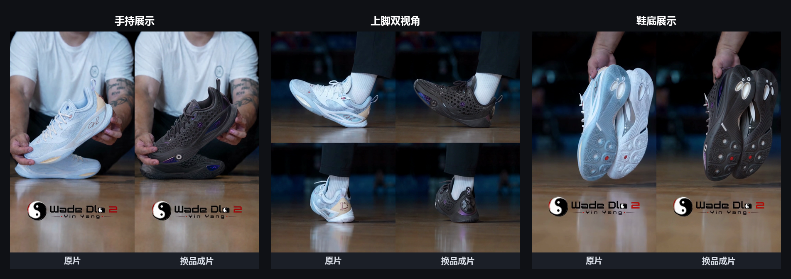

| 任务型 | 做什么 | 关键机制 |
|---|---|---|
| **换品** | 同一条母片换成另一款鞋 | 逐镜头关键帧换图 + Seedance 编辑模式重生成；鸳鸯款左右脚独立绑定 |
| **换景** | 换品的同时换人（肤色、纹身）和场地（室内/室外球场） | 预设库随机组合（肤色 5 × 腿部纹身 8；场地维度组合 330 种）+ 逐镜显式图像绑定 |
| **换语种** | 整片翻译成另一种语言 | 两条通路串联：即梦"视频翻译 2.0"打通 29 语种源限制，VOD"声影智译"拿回音色、术语、逐句校对 |
| **画面字幕** | 烧死在画面上的旧字幕换成译文 | 视觉 OCR 检测（1fps 采样）→ 翻译 → 擦除（provider 隔离）→ 术语库约束的重烧，免费重烧 |
| **比例转换** | 竖屏/横屏互裁 | 按移动轴取景，竖裁偏下 0.62（实测竖屏主体几乎总在下半部） |
| **画质增强** | 本地 GPU 放大 | Topaz Gaia HQ · 4x · HEVC 编码 |
| **剪映草稿** | 输出可继续编辑的工程文件 | `jy:*` 系列脚本，剪辑同事拿到的不是成品而是项目 |

---

## 界面展示

### 主页

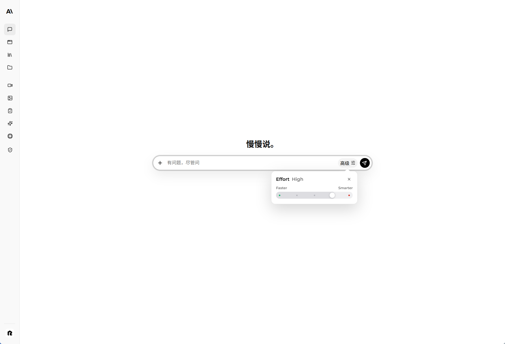

**实现逻辑：** 以自然语言作为统一入口，根据对话意图关联项目、文件库和可用工具，再把任务分发到对应工作台。

**核心能力：** 用户可以直接描述需求、继续已有项目，并从一个入口调用各类视频与图片生产能力。

### 视频替换工作台

#### 换品

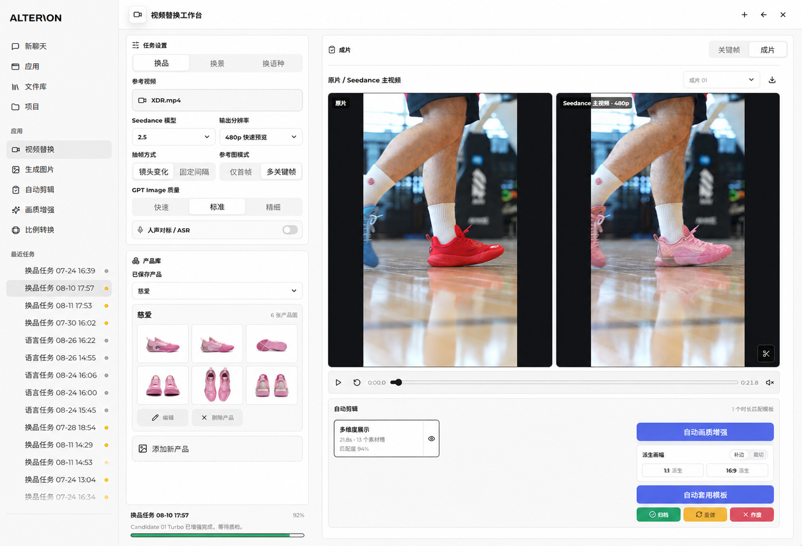

**实现逻辑：** 自动切分镜头并抽取关键帧，将多视角产品图绑定到换图模型生成目标关键帧，再用 Seedance 编辑模式逐镜重生成并回拼；左右脚、鞋底和关键展示面分别约束。

**核心能力：** 在尽量保留原片动作、机位和节奏的前提下替换鞋型、配色、Logo 与鞋底，并维持多镜头产品一致性。

#### 换景

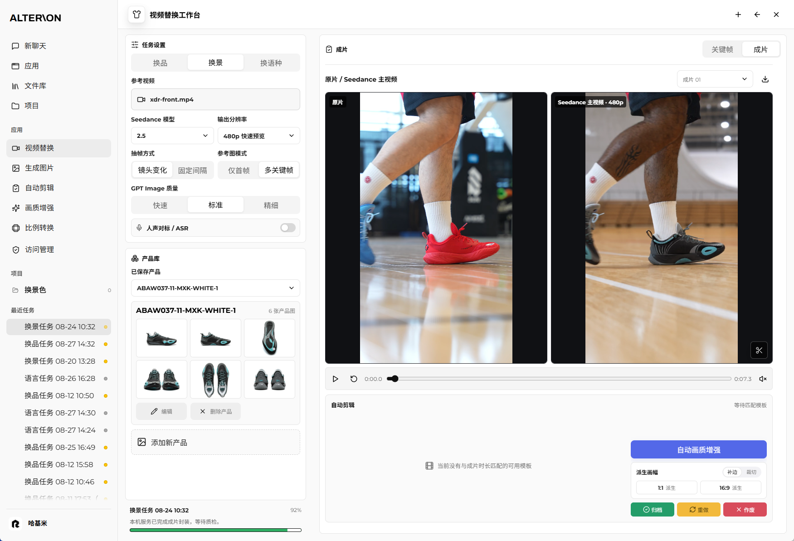

**实现逻辑：** 从人物肤色、纹身和场地预设生成目标关键帧，为每个镜头显式绑定对应参考图，再按原切点生成；存在锁限制模型只修改原画面中真实出现的部位。

**核心能力：** 同一条母片可同时更换商品、人物外观和拍摄场地，并降低背景回退、人物部位凭空生成等问题。

### 图片生成

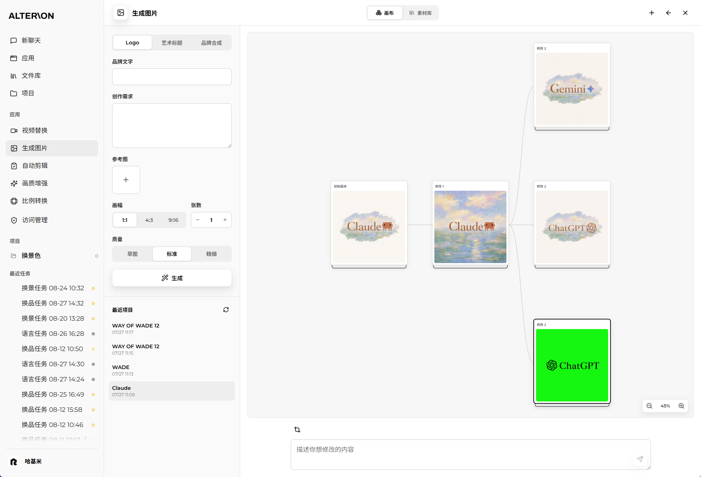

**实现逻辑：** 将提示词、参考图和模型参数组织成可追溯的节点，每次修改从指定版本分支生成，不覆盖已有结果。

**核心能力：** 支持 Logo、艺术标题和品牌视觉合成，并能围绕任意结果继续多轮修改、对比和回退。

### 比例转换

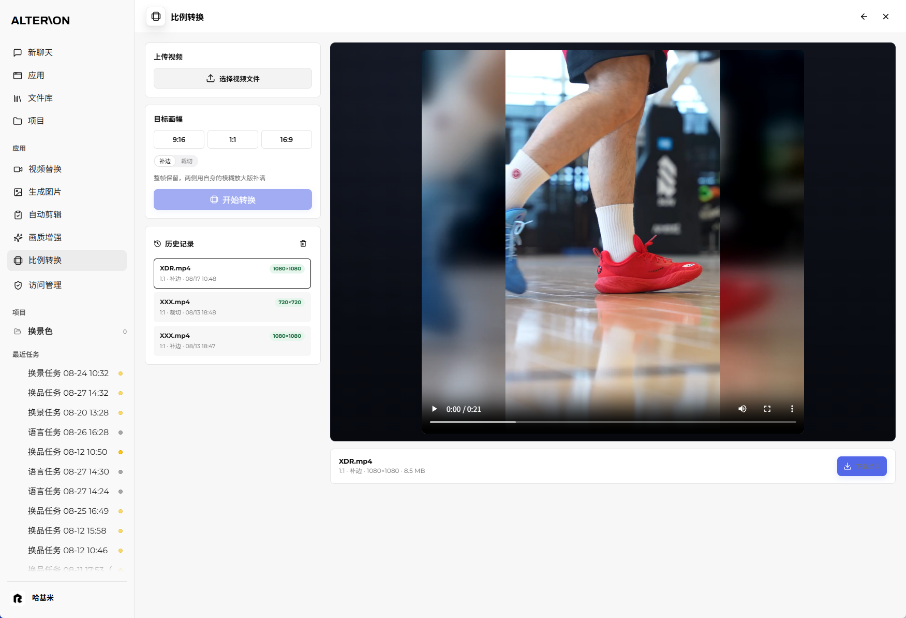

**实现逻辑：** 根据目标画幅自动计算主体取景，可选择裁切或使用原画面的模糊扩展补边，并保留原视频时长和声音。

**核心能力：** 一次生成 9:16、1:1、16:9 等平台规格，减少为 TikTok、Instagram 和横屏渠道重复剪辑。

### 文件库与使用手册

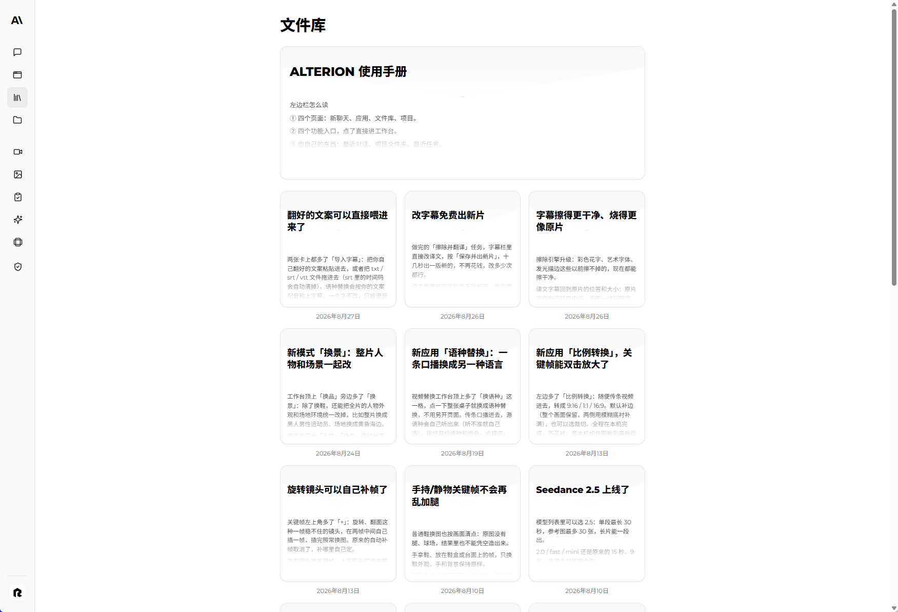

**实现逻辑：** 将操作说明、版本更新和业务文档集中到文件库，功能页面只保留完成任务所需的控件和状态。

**核心能力：** 用户可以按主题查看使用方法和更新记录，避免前端长期堆叠说明性小字。

### 语种替换

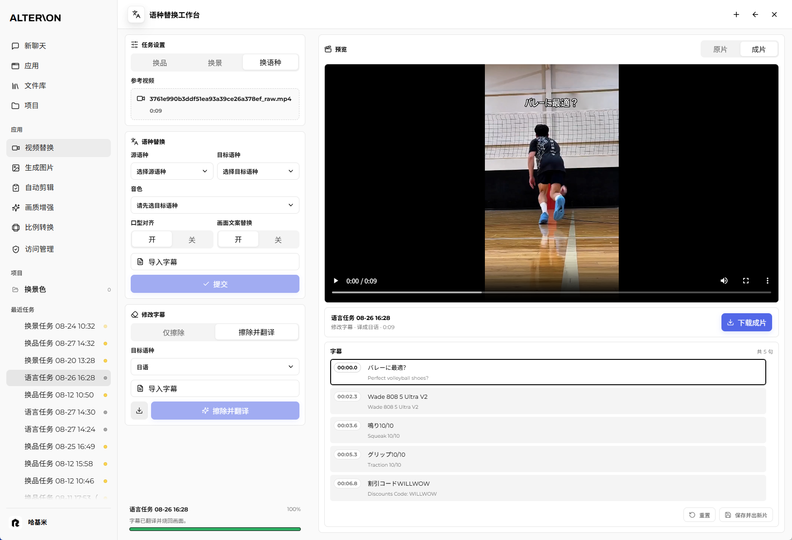

**实现逻辑：** 语音翻译和口型对齐处理声音；画面字幕单独经过 OCR 检测、翻译、擦除和重新烧录，并保留逐句校对入口。

**核心能力：** 支持多语种配音、音色迁移、字幕导入与修订，以及画面内旧字幕的替换。

### 画质增强

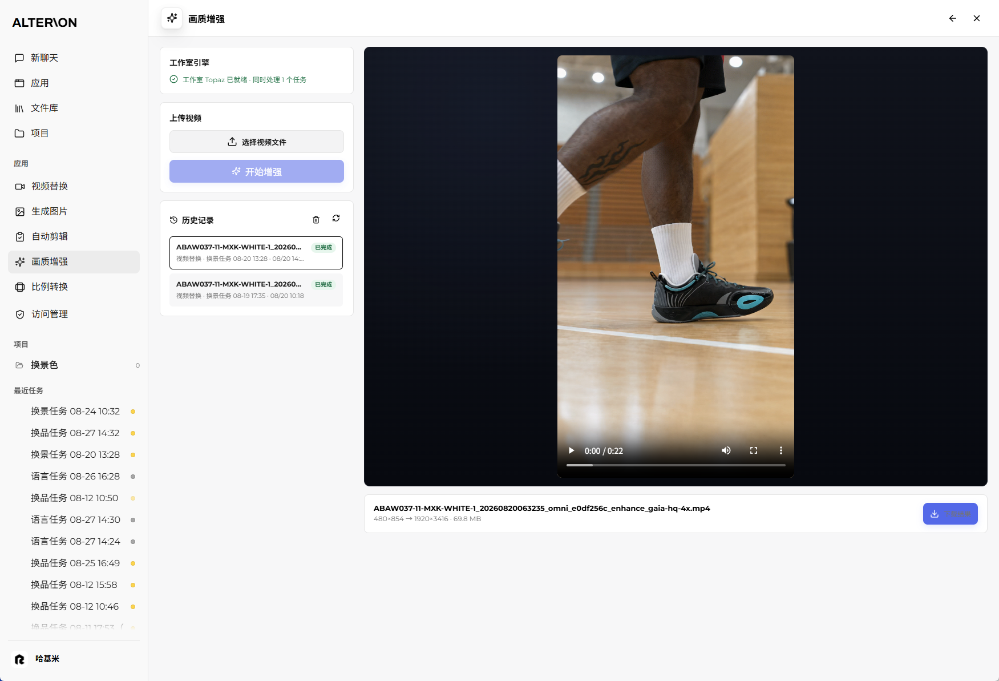

**实现逻辑：** Local Agent 调用本机 Topaz GPU 管线，使用实测选定的 Gaia HQ 模型放大并通过 HEVC 编码输出，任务状态和结果回传网页。

**核心能力：** 将低分辨率生成视频提升到更高规格，增强鞋面纹理、文字边缘和轮廓清晰度，同时避免素材长期停留在中央服务。
---

## 系统架构

三层，各自解决不同的问题：

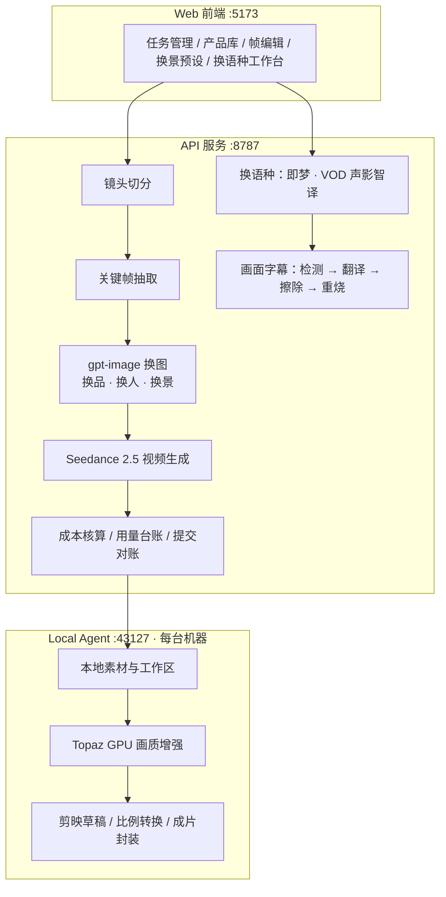

**为什么要有 Local Agent** —— 画质增强要吃满本地 GPU（实测 82% 占用、3.3 GB 显存），放在服务端就变成所有人排队。做成每台机器一个常驻服务后，重活在谁的机器上发起就在谁的机器上跑，服务端只管调度。

---

## 企业部署

这套系统不是一个人的脚本，而是一个在公司局域网上给多名剪辑同事使用了一周的服务。为此做的事：

- **数据不出本机**：源视频、抽帧、关键帧只存在发起者自己的机器上，中央服务只持有元数据；素材要送去云端模型时，按需申请一次性上传凭证，由本机直传对象存储，服务端不经手字节。
- **每台机器一个 Local Agent**：独立更新清单分发、开机自启、keeper 进程看护崩溃重启；网页检测到本机 Agent 后自动接管媒体链路。
- **账号审批与设备分区**：账号注册需审批；任务同时按账号和设备过滤，A 机器看不到 B 机器的素材。
- **付费提交三态对账**：受理号产生在"素材逐个上云"这段长活之后，网络断在受理号前后账目上必须分得清。进程内并发锁防双击双付，SQLite 用量台账 + 火山任务列表自动核对给出"已受理 / 确认未受理 / 处理中"的明确判定，而不是"不知道成功没"。
- **成本先算后跑**：每次提交前给出预估费用；生成模型单价、汇率全部可配置。
- **崩溃恢复与数据保留**：进程重启后扫描恢复在飞任务，人主动收掉的任务不会被复活；运行数据按保留策略清理。
- **用户错误上报**：一键上报带指纹聚合，同类问题合并成一条。

---

## 关键工程决策

**每一条都是先测量、后决策，包括那些测完发现"不该做"的。**

### 1. 从一张账单反推出 Seedance 的计费公式 —— 两个"省钱方案"被它否决

```
tokens = (输入视频时长 + 输出视频时长) × 输出宽 × 输出高 × 24 / 1024
```

| 分辨率 | tokens/秒 |
|---|---|
| 480p | 9,608 |
| 720p | 21,600 |
| 1080p | 48,600 |

公式里只有**输出**尺寸，输入视频只贡献时长——"把参考视频降分辨率能省钱"一分钱不省；计费按秒不按次，与参考图张数无关——"把一次调用拆成多段会更贵"也不成立，反而让单段重拍的代价从整片降到几块钱。

### 2. 产品参考图：额度够就发独立整图，鞋底永远单开

Seedance 2.0 只收 9 张参考图，六个视角只能拼进一张结构图；拆成两张（鞋底独占竖画布、其余六视角横画布网格）后每格面积翻倍。**2.5 收 30 张，拼版就没必要了**：独立白底图同一视角的线性分辨率约是拼版格的六倍，而鞋底纹路、Logo 边缘、中底分层这些"转出关键帧没拍到的面"最吃的细节全在这上面。策略按模型给，认不出的模型按 2.0 算。

后来有一版为省 token 把换图侧也改成拼版，鞋底特写帧立刻出现"原鞋底结构重上色"——1/6 格里读不出外底结构。**鞋底参考图必须单独整图发送**，是一条实测出来的硬规则。

### 3. 换景：像素通道是一个标量旋钮，文字空间里的零和

在视频通道上用「严格 / 贴合 / 硬切 / 以…为准 / 构图 / 机位」任何一个词，颜色、肤色、场地会**一起**被拽回原片；不用禁词但要求"逐时刻同步"的指令效果一样——旋钮认的是**逐帧对照这个行为**，不是词表。全项目唯一实测压得过像素通道的句式是「必须忽略并去除…不属于要参考的画面内容…在成片里不存在，一帧也不出现」。逐镜绑定强度与场地保持在纯文字里零和。完整过程见下方案例。

### 4. 显式声明任务型，把静默错分类变成秒败

Seedance 按提示词关键词把任务分成参考生视频 / 视频编辑 / 视频延长三型，分错了不报错，按错的语义跑完照样扣费。请求体显式携带 `omni_reference_task_type: "edit"` 后，一次因「延续」一词被判成"视频延长"的提交在参数校验阶段就被拒——生成没启动，不计费。

### 5. 外观改造只覆盖外观，永远不覆盖存在性

"人物改为黑人、右小腿有纹身、每一帧必须一致"这类说明，会让模型在只露一只手的产品特写里凭空长出一条带纹身的腿。修法不是删说明，而是在换图模板里立一道存在锁：改造只改"已有部位长什么样"，永远不改"画面里有什么"；改造说明里的「每一帧」只约束真露出该部位的帧；交付前按原帧列出人体部位清单自检。预设库随之改成条件式措辞。

### 6. 画质增强：发现线上链路在**减分**

六个 Topaz 模型鞋面高频能量对比，Gaia HQ 4.841 对当时线上的 Nyx 1.177；15 处逐帧四路对比后 Gaia HQ 每项正面最锐、每项反面不造假。更重要的是：Nyx 是降噪模型，而生成视频没有传感器噪点——它没有噪点可去，就只能去信号，在文字上**一致地比不做增强还差**。

### 7. 放大倍数与编码器上限：两个"看起来很美"的伪优化

4x 与 9.48x 缩到同尺寸比较：SSIM 0.981、体积 3.4 倍、耗时相同——**主动回退到 4x**。硬编码的 4096 放大上限是 H.264 的规格限制而非显卡的：同一张 RTX 4060 上 HEVC/AV1 可到 8192，改成运行时按编码器实测并缓存，720p/1080p 源从被压到 3.2x/2.13x 回到拿满 4x。

### 8. 换语种：两条通路串联，不是二选一

即梦"视频翻译 2.0"29 语种互译但整链黑盒；VOD"声影智译"功能全但源语种只吃中/英。「任意语种 →（即梦）→ 英语 →（声影智译）→ 目标语种」成了通用解：第一跳打通源限制，第二跳拿回可控性。画面字幕单独走确定性管线，唯一要花钱开通的擦除服务被隔离在 provider 接口后——没开通也能产出预览版，每一步先被真素材验收。

---

## 案例：换景的八次单变量实验

同一条 21.85 秒、12 个镜头的母片，目标是**每一镜**都换成关键帧里的新鞋、新人、新球馆。每次提交约 ¥17，只改一个变量，出片后逐镜抽帧判卷：

| # | 变量 | 切点 | 场地 | 结论 |
|---|---|---|---|---|
| 1 | 换品原版提示词 + 改造说明 | 丢短镜头 | 部分回退 | 时间表声明的切点被关键帧微调污染 |
| 2 | 切镜行加「严格 / 硬切」 | 对 | **全片回退原片** | 保真度词是全局标量，禁用 |
| 3 | 切点与画面时刻解耦 | 12/12 | 前 4 镜回退 | 结构性 bug 修掉，剩纯像素对抗 |
| 4 | 「忽略 + 不存在」条款包 | 12/12 | **12/12** | 两个 0.8s 短镜头内容被邻镜续演顶掉 |
| 5 | + 首帧身份 + 逐时刻同步 | 12/12 | 前 8 镜回退 | 逐帧对照指令等价于保真度词 |
| 6 | 仅首帧身份 | 多一刀 | 前 7 镜回退 | 绑定与场地在文字里零和 |
| 7 | 回到换品同构的简报式写法 | 12/12 | 8/12 | 剩余失守镜头对措辞免疫（Δ≤3 点） |
| 8 | 官方「场景替换为 @图片1」 | 对 | 仅镜头 1 | 被点名的那一镜全对，其余被降权 |
| **9** | **逐镜显式绑定：每镜替换为 @图片N** | 对 | **7/7** | 此前八连全败的镜头全部换干净 |

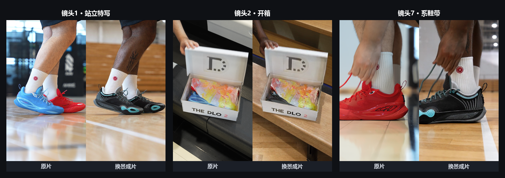

两位独立复核代理推翻过我的两次归因（"低机位特写必失守"被同类镜头 9/12 全对证伪；"相似帧绑定打滑"被丢失的恰是最独特两帧证伪），最终解来自一个简单的设计：**既然被点名的图会赢，就给每一镜点自己的图**。最后一发用 7.4 秒截断片验证（¥6），随后合入主线。

---

## 成本模型

所有单价可配置（`.env`），成本在提交前算出、提交后入账：

| 项目 | 单价 | 实测 |
|---|---|---|
| gpt-image-2 图像输入 / 输出 | $8 / $30 per M tokens | 输出 ≈ 1,300 tokens/帧 |
| Seedance 2.5（含视频输入） | ¥42 /M tokens | 480p ≈ ¥0.40/秒（输入+输出各计） |
| Seedance 2.0 / fast / mini | ¥28 / ¥22 / ¥14 /M tokens | |
| 视觉模型判帧 | | ¥0.0055/帧 |

一条 22 秒换景片 480p 约 ¥17.6；只重跑其中 7 秒约 ¥6；本地增强不产生 API 费用。

---

## 工程约束

```
740 个测试            test/ 123 个文件，与 server 代码量相当
架构守卫              5 条边界规则硬失败 + 文件行数建议信号
类型检查              tsc --noEmit --noUnusedLocals --noUnusedParameters
生产依赖 16 个        绝大部分逻辑自研
```

硬失败的是 5 条边界规则：`src/` 不许 import `server/`、`scripts/`、`local-agent/`；`server/`、`scripts/` 不许 import `src/`；Local Agent 隔离；生产代码不许引测试；不许逃出仓库。**文件行数只是建议信号**——能被机器判死的才判死，判不了的只给提示。

代码注释的约定是**写清楚为什么，并带上实测数字**，包括被否决的方案和否决它的数据。用户校准过的提示词模板是字节锁定的基线：改动一律在编译产物上锚固定句整句替换，替换不成立就抛错。

| 模块 | 文件 | 行数 |
|---|---|---|
| server | 103 | 32,761 |
| src（前端） | 86 | 26,081 |
| test | 123 | 18,646 |
| scripts | 65 | 15,515 |
| local-agent | 9 | 4,910 |

---

## 公开范围

本仓库是 ALTERION 的作品展示页，只包含项目说明与经筛选的演示图片。生产源码、环境配置、密钥、运行数据、内部素材与完整提交历史均保留在私有仓库，不提供部署包或下载版源代码。
---

## 开发方式

项目由我一人主导：需求来自公司剪辑团队的真实产线，所有工程决策、实验设计、验收标准与上线由我拍板；日常实现大量借助 AI 编程代理（Claude Code、Codex）协作完成，代理负责实现、抽帧判卷与交叉复核，我负责提出问题、判断归因和决定方向——上面案例里的最终解「逐镜显式绑定」就是这样得出的。

本展示仓库只保留 README 与经筛选的演示素材；生产源码、配置、内部数据和开发历史均在私有仓库中维护。


---

## 现状与规划

**已完成** —— 视频入库、自动切镜头、关键帧抽取、gpt-image 换品/换人/换景、Seedance 2.5 编辑模式生成、逐镜显式绑定、显式任务型、存在锁、换语种双通路、画面字幕检测/翻译/重烧、比例转换、Topaz 本地增强、剪映草稿产出、成本核算与用量台账、提交对账、账号分区与局域网分发、崩溃恢复与开机自启、数据保留策略。

**已实现、暂未启用** —— 视觉模型自动判展示面（侧面判断 12/12 正确，¥0.0055/帧），实测效率不如人工点选，保留代码不接线。

**进行中** —— 换景全长稳定性（逐镜显式绑定在 7 镜片段 7/7，全长 12 镜待复核；若后半段仍失守，按全局规则分段并配帧精确拼接与逐镜自动验收）；旧字幕擦除服务接入。

**规划** —— 白模驱动（把参考视频换成不含原片外观的运动代理，从结构上消灭场地回退）；脚本文案生成；3D 重建替代固定角度产品照。

---

## 技术栈与许可

`React 19` · `Vite` · `Express 5` · `Node.js ESM` · `SQLite` · `ffmpeg` · `Topaz Video AI` · `gpt-image-2` · `Seedance 2.5` · `火山 TOS / VOD` · `即梦视频翻译`

本仓库作为面试作品灰度展示，保留所有权利；示例画面中的商品与素材归其品牌方所有。
